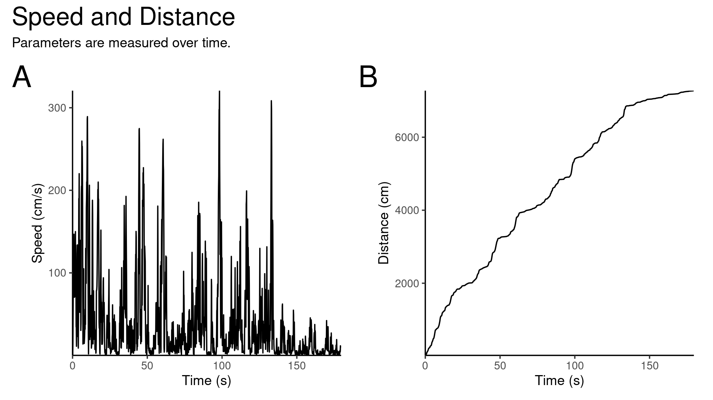
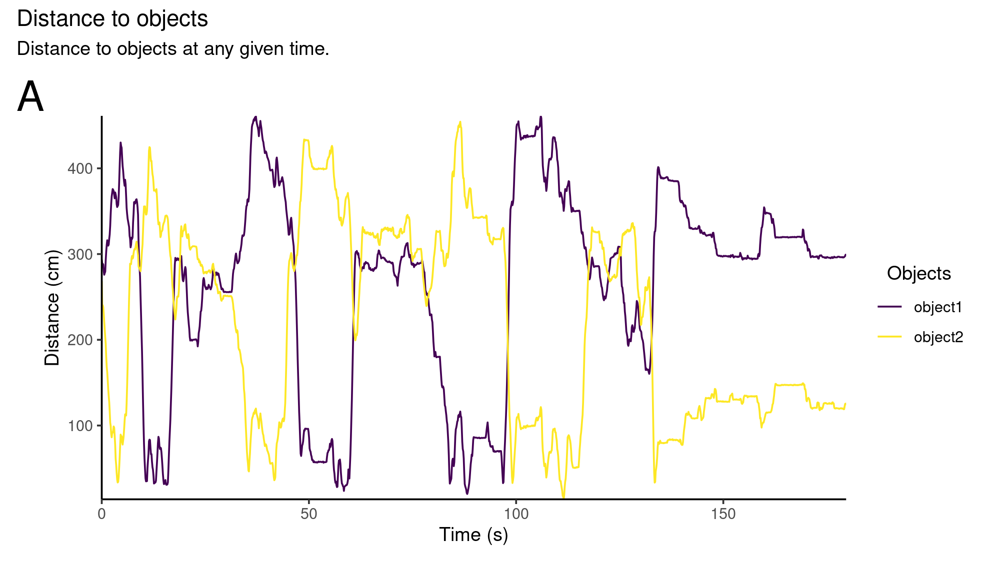
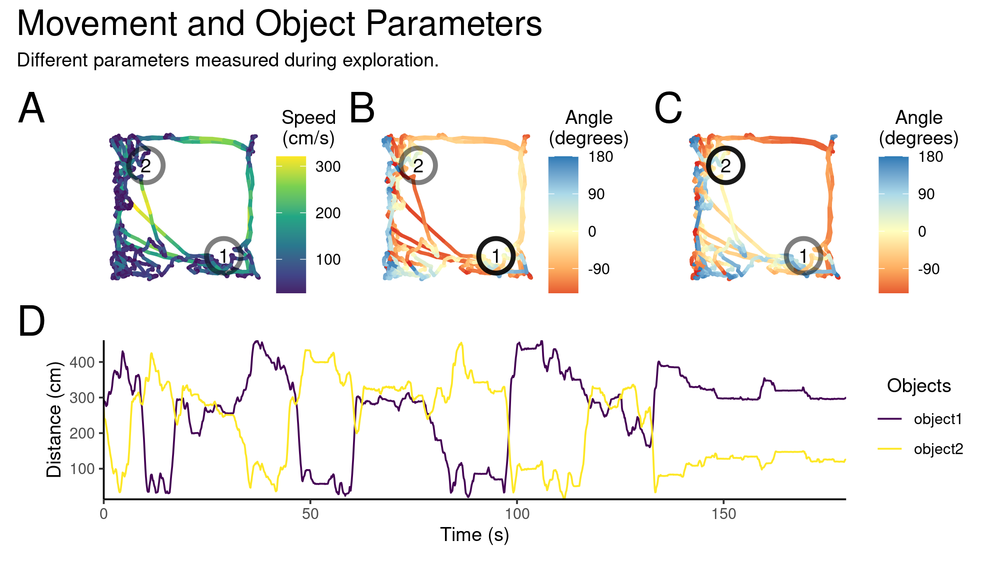
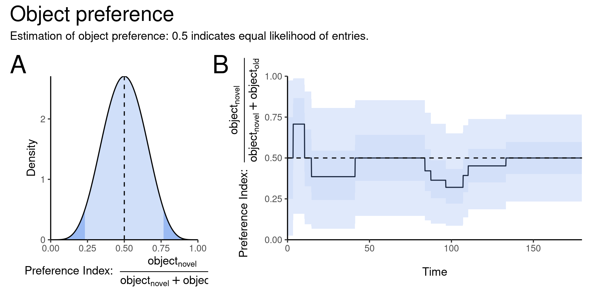

README
================

# BehaviouR

The newest version of the package can be downloaded via
`devtools::install_github(repo = "danielparthier/BehaviourAnalysis", ref
= "package", dependencies = T)`.

The task in the video is based on the *Novel-Object Recognition Task*.
Therefore, we have two objects in the arena which are explored by the
mouse. The data generated by DeepLabCut can be returned as csv file and
includes labels, coordinates but also the likelihood for any given label
at any given point in time. The sampling rate of the video in this
example is a 1/3 of 25 Hz which makes it a frame rate of 8.33 Hz. The
reason for the 1/3 term is the recording format *.avi* where every third
frame is saved and the rest skipped and interpolated later.

``` r
FileName <- paste0("RawData/20180903_Schmitz_PaS_B1_C1_NL_",
                   "Day1_NOVEL_DSC001663DLC_resnet50_NOVEL_",
                   "VIDEONov7shuffle1_100000.csv")
FrameRate <- 25/3
ObjectNumber <- 2
```

## Load Data

The data can be loaded using the `BehaviouR` package with its function
`DeepLabCutLoad()`. The function requires some information about the
labels one is interested in, namely body parts and objects. In this case
we define two groups of the mouse (head and body). These two groups are
then subdivided into different parts/labels which are forming the
structure. The labels have to refer to column names which appear in the
DeepLabCout output. In the following example *ear*, *nose* and *ear*,
*tail*. When the term *“ear”* is used the function will search for any
label which contains the term. Therefore, *leftear* and *rightear* are
both included. However, this requires explicit labels in cases where
only one of the two is required. The scaling arguments can be used to
adjust for the unit size per pixel. The tracked labels will be checked
for irregularities based on the distribution of the differences over
time. If the coordinates are detected as outliers they will be removed
and interpolated by B-splines.

``` r
library(BehaviouR)
library(ggplot2)
library(patchwork)
library(data.table)

MouseBodyList <- list()
MouseBodyList$head <- c("ear", "nose")
MouseBodyList$body <- c("ear", "tail")
ObjectList <- list("object1", "object2")

MouseDataTable <- DeepLabCutLoad(FileName = FileName,
                                 FrameRate = FrameRate,
                                 MouseLabels = MouseBodyList,
                                 ObjectLabels = ObjectList,
                                 ObjectNumber = ObjectNumber,
                                 xScale = 0.91,
                                 yScale = 0.91,
                                 JumpCorrections = T,
                                 includeAll = F)
```

    ## all labels:
    ## leftear
    ## rightear
    ## nose
    ## tailbase
    ## object1
    ## object2

``` r
summary(MouseDataTable)
```

    ##             Length Class      Mode
    ## DataTable   14     data.table list
    ## ObjectTable  3     data.table list

## Calculate Egocentric Parameters

The output of `MouseDataTable` will be a list consisting of two
`data.table`s. The first one includes the egocentric coordinates of the
mouse which are extracted from the labels provided in the
`MouseBodyList` and the second one will give the table for stationary
objects from the `ObjectList`. If an object is in the list of stationary
objects coordinates will be adjusted and fixed. If the interest is in
objects which move, and this is something which should be kept as
information, it is recommended to put the labels in the `MouseBodyList`
and assign them with for example `MouseBodyList$object` or another clear
description. The input argument for `DeepLabCutLoad` should be including
`ObjectNumber = 0`. The argument `ObjectLabels` will then be ignored.

The package offers some basic functions which allow you to calculate
**speed**, **distance**, **length** or **angle** etc. for different
structures. In this example functions can be applied to the coordinate
table.

``` r
DistSpeedCalc(CoordTable = MouseDataTable$DataTable,
              SpeedRef = "bodyCentroid",
              Interval = 1/FrameRate)
AddCentroid(CoordTable = MouseDataTable$DataTable,
            CornerNames = list("ear"),
            OutputName = "BetweenEars")
VectorLength(CoordTable = MouseDataTable$DataTable,
             VectorStart = "tailbase",
             VectorEnd = "BetweenEars",
             OutputName = "BodyLength")
AngleCalc(CoordTable = MouseDataTable$DataTable,
          VectorStart1 = "BetweenEars",
          VectorEnd1 = "nose",
          OutputName = "HeadAngle")
AngleCalc(CoordTable = MouseDataTable$DataTable,
          VectorStart1 = "tailbase",
          VectorEnd1 = "BetweenEars",
          OutputName = "BodyAngle")
AngleDiff(CoordTable = MouseDataTable$DataTable,
          Angle1 = "BodyAngle",
          Angle2 = "HeadAngle",
          OutputName = "ViewAngle")
```

## Calculate Stationary Object Parameters

The object specific calculations can be performed in the same way.
`ObjectDistance()` will calculate the distances from a reference point
to **all** the objects in the `ObjectTable`. The calculation for the
approaching angle is performed in a similar manner using
`ObjectAngle()`. The `AddCentroid()` function allows to compute the
centroid of a multi-label structure. This helps to evaluate a position
of an object or can reduce noise.

``` r
ObjectDistance(CoordTable = MouseDataTable$DataTable,
               ObjectTable = MouseDataTable$ObjectTable,
               Ref = "headCentroid")
ObjectAngle(CoordTable = MouseDataTable$DataTable,
            ObjectTable = MouseDataTable$ObjectTable,
            Ref = "headCentroid")
VectorLength(CoordTable = MouseDataTable$DataTable,
             VectorStart = "nose",
             VectorEnd = "BetweenEars",
             OutputName = "headLength")
AddCentroid(CoordTable = MouseDataTable$DataTable,
            CornerNames = list("ear"),
            OutputName = "BetweenEars")
```

We can also calculate the angle difference for every object, meaning the
of the head in relation to the object, and the entries for the zone
around the object which we will specify based on two criteria. Firstly,
the distance to the centre of the object which we will define by the 95
percentile of the animal length. Secondly, the viewing angle to the
object. The idea behind the angle is to validate active approaching
which requires to look into the direction of the object opposed to
passing by randomly. The cut-off for the angle can be adjusted and is
set here to a ±10th pi, which is a 5th of a circle.

``` r
for(i in MouseDataTable$ObjectTable$ObjectLoc) {
  ObjectString <- grep(pattern = paste0("^", i, "[_][alphanum]",".*","[_]Angle", "$"),
       x = colnames(MouseDataTable$DataTable),
       value = T)
  AngleDiff(CoordTable = MouseDataTable$DataTable,
            Angle2 = "HeadAngle",
            Angle1 = ObjectString,
            OutputName = paste0(i,"_HeadAngle_Angle"))
  ZoneEntry(CoordTable = MouseDataTable$DataTable,
            DistanceRef = paste0(i,"_headCentroid_Distance"),
            Length = quantile(MouseDataTable$DataTable$BodyLength, 0.95),
            AngleInclusion = T,
            AngleRef = paste0(i,"_HeadAngle_Angle"),
            AngleRange = pi/10, 
            Overwrite = T)
}
```

## Plotting Data

The data can be plotted using functions and strings as references. For
some functions 2D and 1D options are available, meaning if `x` and `y`
are valid references a 2D-plot is generated showing the trajectory and
the target parameter in colour code. The `LocationPlot()` further has
the option to output the density/probability of occupancy. The other
possible functions are `SpeedPlot()`, `AnglePlot()`, `DistancePlot()`,
and `LengthPlot()` with their 1D and 2D functionality. Currently, the
plots are implemented with colour blind friendly colour schemes.

``` r
# Plot functions
SpeedPlot <- SpeedPlot(CoordTable = MouseDataTable$DataTable,
                       Speed = "SpeedbodyCentroid",
                       CoordRef = "headCentroid",
                       ObjectTable = MouseDataTable$ObjectTable,
                       Unit = "cm/s")

DensityPlot <- LocationPlot(CoordTable = MouseDataTable$DataTable,
                            CoordRef = "headCentroid",
                            ObjectTable = MouseDataTable$ObjectTable,
                            Density = T)


if(ObjectNumber>0) {
  ObjectAnglePlots <- lapply(X = 1:ObjectNumber, FUN = function(objID) {
    AnglePlot(CoordTable = MouseDataTable$DataTable,
              Angle = paste0("object",objID,"_HeadAngle_Angle"),
              CoordRef = "headCentroid",
              ObjectTable = MouseDataTable$ObjectTable,
              colourScheme = "light",
              ObjectHighlight = "alpha")
  })   
}


SpeedPlotLine <- SpeedPlot(CoordTable =  MouseDataTable$DataTable,
                           Speed = "SpeedbodyCentroid",
                           Unit = "cm/s")

DistancePlotLine <- DistancePlot(CoordTable = MouseDataTable$DataTable,
                                 Distance = "CumDistbodyCentroid",
                                 Unit = "cm")

ObjectDistancePlotLine <- DistancePlot(CoordTable = MouseDataTable$DataTable,
                                       Distance = "headCentroid_Distance",
                                       ObjectTable = MouseDataTable$ObjectTable,
                                       ObjectDistance = T,
                                       Unit = "cm")

RearingPlotLine <- LengthPlot(CoordTable = MouseDataTable$DataTable,
                              Length = "BodyLength")

RearingPlot <- LengthPlot(CoordTable = MouseDataTable$DataTable,
                          Length = "BodyLength",
                          CoordRef = "headCentroid",
                          ObjectTable = MouseDataTable$ObjectTable) +
  scale_color_viridis_c(guide = guide_colourbar(title = "Rearing", label = FALSE, reverse = T), direction = -1)
```

    ## Scale for 'colour' is already present. Adding another scale for 'colour',
    ## which will replace the existing scale.

The plots can be arranged and panels generated by using the `patchwork`
library.

``` r
# Arrange Plots
if(ObjectNumber>0) {
  MovementPlot <- (SpeedPlot | ObjectAnglePlots[[1]] | ObjectAnglePlots[[2]]) / ObjectDistancePlotLine &
    plot_annotation(title = "Movement and Object Parameters", subtitle = "Different parameters measured during exploration.",tag_levels = "A") &
    theme(plot.title = element_text(size=20),plot.tag = element_text(size=24))
}

OutPutPlotRearing <- RearingPlotLine + RearingPlot &
  plot_annotation(tag_levels = "A") & 
  plot_annotation(title = "Rearing", subtitle = "Rearing during exploration is mainly seen close to walls or objects.",tag_levels = "A") &
  theme(plot.title = element_text(size=20),plot.tag = element_text(size=24))
OutPutPlotMap <- (SpeedPlot + DensityPlot) + plot_annotation(tag_levels = "A") &
  plot_annotation(title = "Exploration", subtitle = "Speed and location during exploration of arena.",tag_levels = "A") &
  theme(plot.title = element_text(size=20),plot.tag = element_text(size=24))
OutPutPlotMovement <- SpeedPlotLine + DistancePlotLine + plot_annotation(tag_levels = "A") &
  plot_annotation(title = "Speed and Distance", subtitle = "Parameters are measured over time.",tag_levels = "A") &
  theme(plot.title = element_text(size=20),plot.tag = element_text(size=24)) & theme(plot.tag = element_text(size=24)) 
```

The plot for speed (2D) and occupancy (2D):


The plot for speed (1D) and Distance (1D):


The plot for stationary object distances:


The plots for speed, object approach angle for both objects, and the
distance to the objects over time:


The last plot shows the rearing measured as the length of the body. If
the animal is walking normally the vector length will be long. If the
animal rears, meaning it will get up, the vector will be shorter.


Any further adjustments or changes to the plot can be appended. For
example when a different label is required one can add the `ggplot2`
functions to the generated plot. In the following case we want to change
the *“Rearing”* to a more specific *“Normalised Rearing”*. Further we
will remove the numbers (*label*) next to the colour bar. Since it is a
arbitrary measure absolute numbers might not be required.

``` r
RearingPlot+
  scale_color_viridis_c(option = "magma",guide = guide_colourbar(title = "Normalised\nRearing", label = FALSE, ticks = F), direction = -1) & 
  plot_annotation(title = "Rearing during exploration", subtitle = "The change of posture can be reflected in the rearing.") &
  theme(plot.title = element_text(size=20))
```

    ## Scale for 'colour' is already present. Adding another scale for 'colour',
    ## which will replace the existing scale.


With the given `DataTable` structure we can further compute parameters
derived from the interaction with the objects. One example would be to
estimate the preference for an object based on the entries. To get an
estimate given the data we have we can use the binomial distribution
*Binom(n,p)* and the beta distribution *Beta(a, b)* Using this
distribution we will get a Bayesian estimate of the preference parameter
*X \~ Beta(a, b)*. The binomial and beta distribution are conjugate,
meaning we can use a beta distribution as a prior which in our case is
*Beta(1, 1)*. A flat prior which attributes all probabilities equally.
When updating the function after getting new data we will update *a* and
*b*. Let’s assume we count 5 entries at on object and 5 at the other we
would update the function such as *X* *\~* *Beta(1+5, 1+5)*. Therefore
we reallocate all the probabilities according to the data and get a
distribution of possible outcomes.



The combination of functions and plotting features will allow for easier
analysis of the `DeepLabCut` output and make data more approachable.
Future features will include measures to quantify behaviour and
adjustments to object plotting and analysis allowing for more
flexibility.
